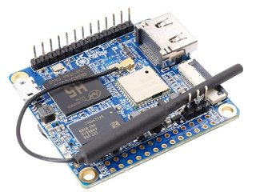
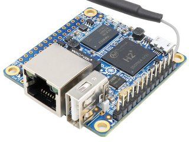

## Orange Pi Zero + Orange Pi Zero Plus 2 - H3 & H5 - download mirror

* [orange pi zero h2](#orange_pi_zero_h2) 
| [orange pi zero plus2 h3](#orange_pi_zero_plus_2_h3_new) 
| [orange pi zero plus2 h5](#orange_pi_zero_plus_2_h5_new)
* downloaded from: http://www.orangepi.org/downloadresources/
* files checksums:  https://github.com/orangepi0/downloads/releases/download/orange_pi_zero/md5sum.list
| https://github.com/orangepi0/downloads/releases/download/orange_pi_zero/files.list
| https://github.com/orangepi0/downloads/releases/download/orange_pi_zero/downloads.list
* How to: [get check & write image to sd card](#how_to_get_check_write_image_to_sd_card)

---

## Orange Pi Zero Plus 2 - H5 (NEW)

---

### Debian_Jessie_For_OrangePiZeroPlus2H5



* FILE: https://github.com/orangepi0/downloads/releases/download/orange_pi_zero/debian_jessie_zeroplus2_H5_V0_2.img.xz
* PAGE: http://www.orangepi.org/downloadresources/orangepizeroplus2H5/2017-03-30/orangepizeroplus2H5_1479af2a6759bce3.html
* FROM: http://pan.baidu.com/s/1eRJNCqA

```Version： 0.9.1
Release date： 2017-03-30
Release notes： user(root), password(orangepi)
```    

---

### Arch_Linux_For_OrangePiZeroPlus2H5

* FILE: https://github.com/orangepi0/downloads/releases/download/orange_pi_zero/arch_linux_zeroplus2_H5_V0_2.img.xz
* PAGE: http://www.orangepi.org/downloadresources/orangepizeroplus2H5/2017-03-30/orangepizeroplus2H5_cd0c73d01ae7917f.html
* FROM: http://pan.baidu.com/s/1jIE6bUA

```Version： 0.9.1
Release date： 2017-03-30
Release notes： user(root), password(orangepi)
```

---

### Ubuntu_Xenial_For_OrangePiZeroPlus2H5

* FILE: https://github.com/orangepi0/downloads/releases/download/orange_pi_zero/ubuntu_xenial_zeroplus2_H5_V0_2.img.xz
* PAGE: http://www.orangepi.org/downloadresources/orangepizeroplus2H5/2017-03-30/orangepizeroplus2H5_989b97fd5964217f.html
* FROM: https://pan.baidu.com/s/1qYfhUSO


```Version： 0.9.1
Release date： 2017-03-30
Release notes： user(root), password(orangepi)
```

---

### Android For Orange Pi Zero Plus2 H5

* FILE: https://github.com/orangepi0/downloads/releases/download/orange_pi_zero/android_zeroplus2_H5_V0_1.img.rar
* PAGE: http://www.orangepi.org/downloadresources/orangepizeroplus2H5/2017-03-30/orangepizeroplus2H5_114f1fdd87e9bb20.html
* FROM: https://pan.baidu.com/s/1hsDolGo

Here are the instructions for the TF Card setup – read them carefully and follow them exactly. Refer to this webpage

http://www.orangepi.org/Docs/SDcardinstallation.html#Install_Android_OS_image

```Version：                 0.8.0
    Release date：      2017-03-30
    Release notes:
```

---

## Orange Pi Zero Plus 2 - H3 (NEW)

---

### Debian_Desktop_Jessie_For_OrangePiZeroPlus2H3


* FILE: https://github.com/orangepi0/downloads/releases/download/orange_pi_zero/debian_desktop_jessie_zeroplus2_H3_V0_1.img.xz
* PAGE: http://www.orangepi.org/downloadresources/orangepizeroplus2H3/2017-03-30/orangepizeroplus2H3_d7002ea6d32902a4.html
* FROM: https://pan.baidu.com/s/1b0sVnw

```Version： 0.9.1
Release date： 2017-03-30
Release notes： user(root), password(orangepi)
```

---

### Dubuntu_Desktop_Xenial_For_OrangePiZeroPlus2H3

* FILE: https://github.com/orangepi0/downloads/releases/download/orange_pi_zero/ubuntu_desktop_xenial_zeroplus2_H3_V0_1.img.xz
* PAGE: http://www.orangepi.org/downloadresources/orangepizeroplus2H3/2017-03-30/orangepizeroplus2H3_1e5f476831686b19.html
* FROM: https://pan.baidu.com/s/1slrXdjJ

```Version： 0.9.1
Release date： 2017-03-30
Release notes： user(root), password(orangepi)
```

---

### Ubuntu_Server_Xenial_For_OrangePiZeroPlus2H3

* FILE: https://github.com/orangepi0/downloads/releases/download/orange_pi_zero/ubuntu_server_xenial_zeroplus2_H3_V0_1.img.xz
* PAGE: http://www.orangepi.org/downloadresources/orangepizeroplus2H3/2017-03-30/orangepizeroplus2H3_c19a9605eff78bb7.html
* FROM: http://pan.baidu.com/s/1eSOhAka

```Version： 	0.9.1
Release date： 	2017-03-30
Release notes： 	user(root), password(orangepi)
```

---

### Android For Orange Pi Zero Plus2 H3

* FILE: https://github.com/orangepi0/downloads/releases/download/orange_pi_zero/android_zeroplus2_H3_V0_1.img.rar
* PAGE: http://www.orangepi.org/downloadresources/orangepizeroplus2H3/2017-03-30/orangepizeroplus2H3_2da0a1bf05d16b91.html
* FROM: https://pan.baidu.com/s/1dFwzprN

Some software called PhoenixCard is needed for the TF Card setup for all Android images.
(This currently only works in Windows. Versions for other OSs such as Linux are temporarily unavailable - sorry.)

Note: do not try using TF Formatter & Win32 Disk Imager on any Android image – this method just won't work!

To get the PhoenixCard software, try any of these links. After installation and then starting the program (Run as Administrator) for the first time, remember to click the 'Update Version' button (in the top right of the window) before doing any TF card burning. As always when writing images, only have your main hard drive running and one USB device (the card in the card reader) attached. It's very easy to accidentally write to the wrong drive!!

Here are the instructions for the TF Card setup – read them carefully and follow them exactly. Refer to this webpage

http://www.orangepi.org/Docs/SDcardinstallation.html#Install_Android_OS_image

```Version：           0.8.0
Release date：      2017-03-30
Release notes:	
```

---

## Orange Pi Zero H2+ 

---

### Debian server Orange Pi Zero



* FILE: https://github.com/orangepi0/downloads/releases/download/orange_pi_zero/debian_server_For_OrangePizero_v0_9_2.img.xz
* PAGE: http://www.orangepi.org/downloadresources/orangepizero/2016-11-10/orangepizero_822d9a74b5f51538a639323.html
* FROM: https://pan.baidu.com/s/1qYm2TI0

```Version： 0.9.2
Release date： 2016-12-01
Release notes： user(root), password(orangepi)
```

---

### debian desktop OrangePizero v0_8_2

* FILE: https://github.com/orangepi0/downloads/releases/download/orange_pi_zero/debian_desktop_For_OrangePizero_v0_8_2.img.xz
* PAGE: http://www.orangepi.org/downloadresources/orangepizero/2016-11-24/orangepizero_3cf6c29678464e7ae2cd8cb.html
* FROM: https://pan.baidu.com/s/1jIqJkNG

```Version： 0.9.1
Release date： 2016-12-05
Release notes： user(root), password(orangepi)
```

---

### ubuntu_server_For_OrangePi_Zero

* FILE: https://github.com/orangepi0/downloads/releases/download/orange_pi_zero/ubuntu_server_1604_For_OrangePi-zero_v0_8_1.img.xz
* PAGE: http://www.orangepi.org/downloadresources/orangepizero/2016-11-10/orangepizero_2bd2a7065774d3da94ad862.html
* FROM: https://pan.baidu.com/s/1slRcak9

```Version 0.8.0
Release date: :  2016-11-24
Release notesusername(root/orangepi), password(orangepi)
```

---

### Android For Orange Pi Zero

* FILE: https://github.com/orangepi0/downloads/releases/download/orange_pi_zero/sun8iw7p1_android_dolphin-p2_uart0.rar
* PAGE: http://www.orangepi.org/downloadresources/orangepizero/2016-11-05/orangepizero_c4dd13ad7ac7ac40c0bc9a1.html
* FROM: http://pan.baidu.com/s/1mipr5v6

Some software called PhoenixCard is needed for the TF Card setup for all Android images.
(This currently only works in Windows. Versions for other OSs such as Linux are temporarily unavailable - sorry.)
 
Note: do not try using TF Formatter & Win32 Disk Imager on any Android image – this method just won't work!
 
To get the PhoenixCard software, try any of these links. After installation and then starting the program (Run as Administrator) for the first time, remember to click the 'Update Version' button (in the top right of the window) before doing any TF card burning. As always when writing images, only have your main hard drive running and one USB device (the card in the card reader) attached. It's very easy to accidentally write to the wrong drive!!

Here are the instructions for the TF Card setup – read them carefully and follow them exactly. Refer to this webpage

http://www.orangepi.org/Docs/SDcardinstallation.html#Install_Android_OS_image

```Version：           0.8.0
    Release date：      2016-11-24
    Release notes：      
```

---

## Schemes

* https://github.com/orangepi0/downloads/releases/download/orange_pi_zero/ORANGE_PI-ZERO-PLUS2_V1_0.djvu
* https://github.com/orangepi0/downloads/releases/download/orange_pi_zero/ORANGE_PI-ZERO-PLUS2_V1_0.pdf
* https://github.com/orangepi0/downloads/releases/download/orange_pi_zero/orange_pi-zero-v1_11.djvu
* https://github.com/orangepi0/downloads/releases/download/orange_pi_zero/orange_pi-zero-v1_11.pdf

---

## Downloads

### Orange Pi Zero Plus 2 - H5

* https://github.com/orangepi0/downloads/releases/download/orange_pi_zero/debian_jessie_zeroplus2_H5_V0_2.img.xz
* https://github.com/orangepi0/downloads/releases/download/orange_pi_zero/ubuntu_xenial_zeroplus2_H5_V0_2.img.xz
* https://github.com/orangepi0/downloads/releases/download/orange_pi_zero/arch_linux_zeroplus2_H5_V0_2.img.xz
* https://github.com/orangepi0/downloads/releases/download/orange_pi_zero/android_zeroplus2_H5_V0_1.img.rar

### Orange Pi Zero Plus 2 - H3

* https://github.com/orangepi0/downloads/releases/download/orange_pi_zero/debian_desktop_jessie_zeroplus2_h3_V0_1.img.xz
* https://github.com/orangepi0/downloads/releases/download/orange_pi_zero/ubuntu_desktop_xenial_zeroplus2_H3_V0_1.img.xz
* https://github.com/orangepi0/downloads/releases/download/orange_pi_zero/android_zeroplus2_H3_V0_1.img.rar
* https://github.com/orangepi0/downloads/releases/download/orange_pi_zero/ubuntu_server_xenial_zeroplus2_H3_V0_1.img.xz

### Orange Pi Zero

* https://github.com/orangepi0/downloads/releases/download/orange_pi_zero/debian_desktop_For_OrangePizero_v0_8_2.img.xz
* https://github.com/orangepi0/downloads/releases/download/orange_pi_zero/debian_server_For_OrangePizero_v0_9_2.img.xz
* https://github.com/orangepi0/downloads/releases/download/orange_pi_zero/sun8iw7p1_android_dolphin-p2_uart0.rar
* https://github.com/orangepi0/downloads/releases/download/orange_pi_zero/ubuntu_server_1604_For_OrangePi-zero_v0_8_1.img.xz

### Add

* https://github.com/orangepi0/downloads/releases/download/orange_pi_zero/md5sum.list
* https://github.com/orangepi0/downloads/releases/download/orange_pi_zero/files.list
* https://github.com/orangepi0/downloads/releases/download/orange_pi_zero/downloads.list

## How to get check & write image to sd card

get

    cd /tmp
    src=https://github.com/orangepi0/downloads/releases/download/orange_pi_zero
    img=ANY_IMAGE_FILE_FROM_THERE.img.xz
    img=debian_jessie_zeroplus2_H5_V0_2.img.xz
    wget -c $src/$img

check

    wget -c $src/md5sum.list
    grep $img md5sum.list | md5sum -c

write 

    xz -dc $img | dd bs=40960 of=/dev/mmcblk0
    sync

## Links

* https://github.com/orangepi0/downloads/releases/tag/orange_pi_zero
* https://orangepi0.github.io/#downloads
* http://www.orangepi.org/downloadresources
